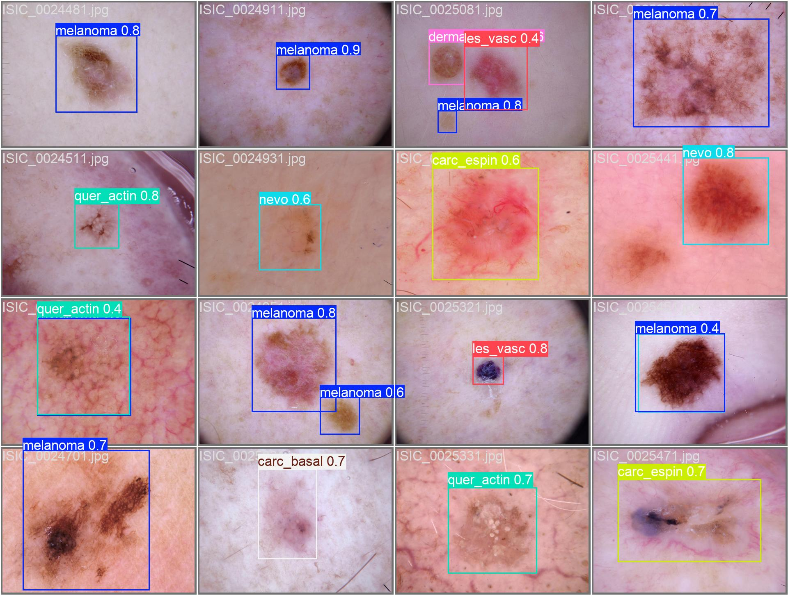

### Suporte ao diagnóstico de câncer de pele com inteligência artificial: estudo piloto

This paper was published in Revista Brasileira de Cancerologia, Volume X, Issue Y, available at [link](https://rbc.inca.gov.br/).

This supplementary material provides the database used, detailed results, and the collaboration network figures.

## Table of Contents

- [Introduction](#Introduction)
- [Dataset](#Dataset)
- [Results](#Results)
- [Copyright](#Copyright)
- [Citation](#Citation)

## Introduction

For more details about the study, we suggest reading the full article.

## Dataset

Data used in this experiment were generated by the International Skin Imaging Collaboration (ISIC).

The image set used is available [here](https://isic-challenge-data.s3.amazonaws.com/2019/ISIC_2019_Training_Input.zip).

The training ground truth is available [here](https://isic-challenge-data.s3.amazonaws.com/2019/ISIC_2019_Training_Input.zip).

The annotation files will be available soon.

For more information about the dataset, [click here](https://challenge.isic-archive.com/data/#2019).

## Results
[click here](https://github.com/Sandrocamargo/publications/tree/main/rbc25a/results)

## Copyright

This material is available by [Creative Commons](https://creativecommons.org/licenses/by/3.0/) License. Therefore, it can be freely reused as long as the source is cited.

## Citation

Soon.
